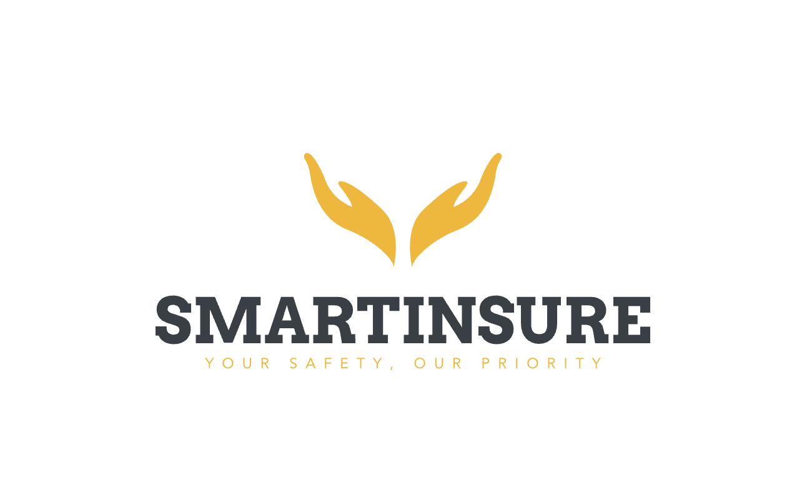
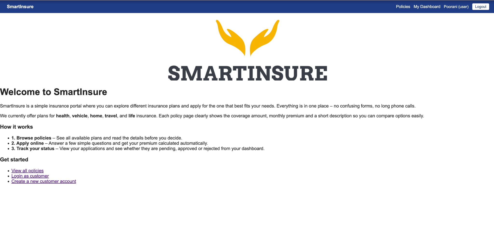
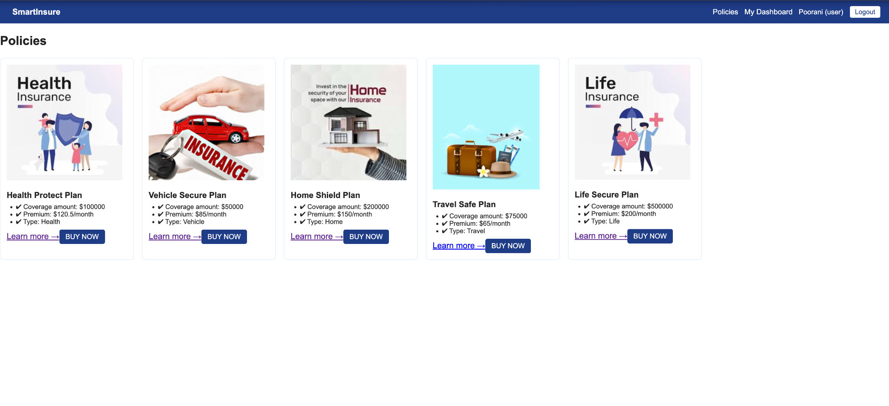
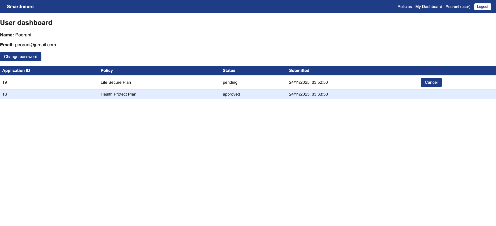
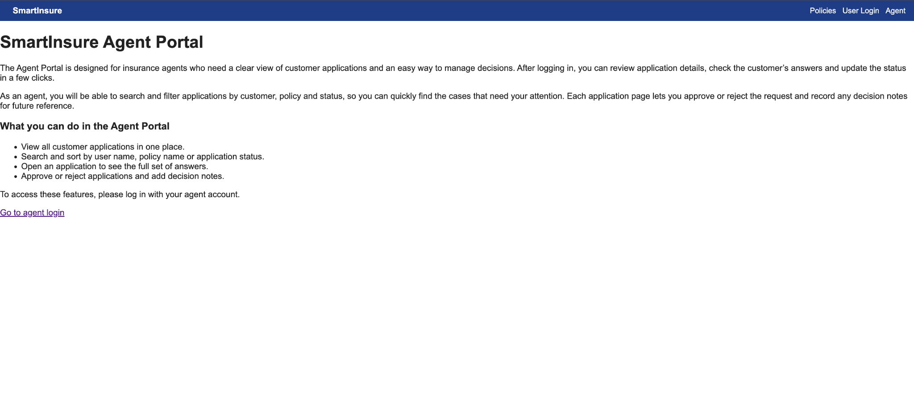
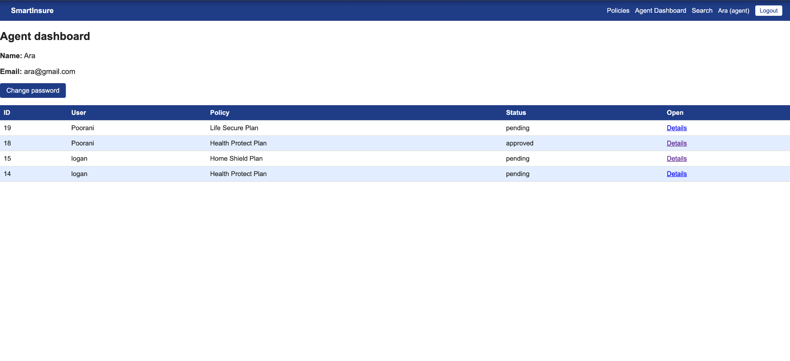
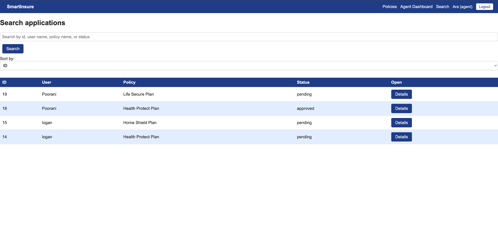

## 5.1 Screenshot / Logo

### Key Screens

**User Home + Policies**

  

**User Dashboard**

**Agent Portal**

  
  

## 5.2 App name & description

### SmartInsure – Simple Online Insurance Portal

SmartInsure is a web application that lets customers browse different insurance plans, get an estimated premium, and submit applications online. An agent portal allows insurance agents to review these applications, make decisions, and add decision notes.

**User features**

- Browse health, vehicle, home, travel and life insurance policies.  
- See key details like coverage amount and monthly premium for each policy.  
- Fill in a short, policy-specific form to get an estimated premium using a simple formula.  
- Submit an application and track its status (pending, approved, rejected) from the user dashboard.  
- Cancel an application while it is still pending.  
- Manage their account and change password securely.

**Agent features**

- View all customer applications in one place.  
- See customer name, policy name, status and submission time.  
- Search and sort applications by user name, policy name or status.  
- Open an application to view all answers in a clean list format.  
- Approve or reject applications and record decision notes.  
- Change their own password.

**Why I built it**

I built SmartInsure to practice a full-stack MERN-style project with real-world features: authentication, role-based access (user vs agent), CRUD operations, form handling with validation, and a small “AI-ish” part where premiums are calculated from business rules. The goal was to create something that feels like a simple internal tool an insurance company could actually use.

## 5.3 Getting started
 
- **Github repository:** `https://github.com/Vshvalogan/SmartInsure.git`    
- **Planning materials (Trello):** `https://trello.com/invite/b/690d84fa76c4657a014b1920/ATTIfcc145e406e099e1711dcdfb74cc4218CEEF9283/insurace-app`

## 5.4 Attributions

This project used the following external references, resources, and documentation:

Documentation & Technical References

PostgreSQL Constraints Documentation
https://www.postgresql.org/docs/current/ddl-constraints.html

PostgreSQL COALESCE() Function Guide
https://neon.com/postgresql/postgresql-tutorial/postgresql-coalesce

Insurance Premium Formula References

Kotak Life: Explanation of insurance premium fundamentals
https://www.kotaklife.com/insurance-guide/about-life-insurance/what-is-insurance-premium-a-detailed-guide

Design & Logo Resources

Logo inspiration and design elements generated with Looka
https://looka.com/

Assistance from LLM (ChatGPT) for:
  -Generating initial CSS ideas 

## 5.5 Technologies used

**Front-end**

- React (Vite)  
- React Router  
- Fetch API for HTTP requests  
- CSS 

**Back-end**

- Node.js  
- Express  
- PostgreSQL with `pg` client  
- JSON Web Tokens (JWT) for auth  
- `bcryptjs` for password hashing  
- `dotenv` for environment variables  
- CORS middleware

## 5.6 Next steps

- Add pagination and advanced filters on the agent search page.  
- Add file uploads (e.g. ID proof or supporting documents) to applications.  
- Add email notifications when an application is approved or rejected.  
- Add more detailed policy information (FAQ, coverage exclusions, etc.).  
- Add an admin role to manage policies and users from the UI.  
- Improve accessibility and add responsive layout for mobile devices.

